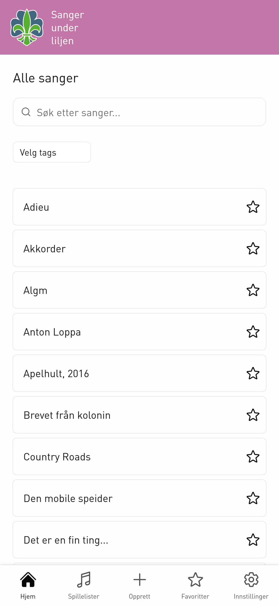
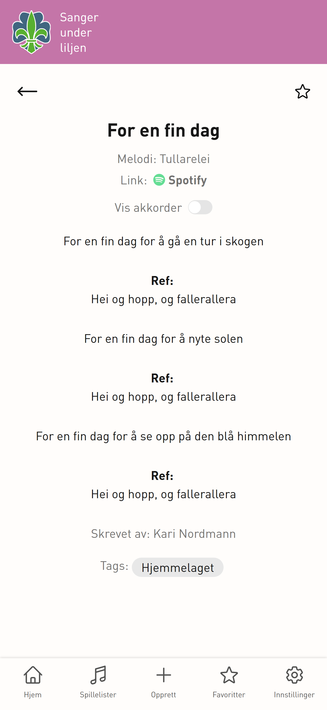
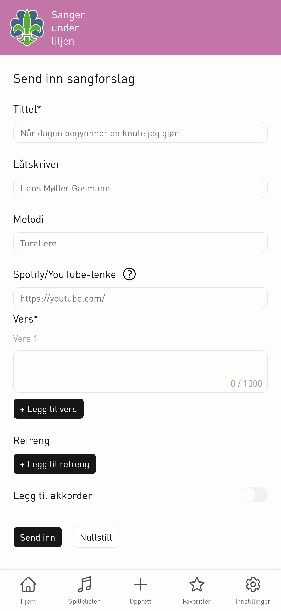

# Digital songbook

This is a digital songbook Progressive Web App (PWA) for browsing and viewing scout songs. The PWA was made for [1. Fredrikstad speidergruppe](https://1fredrikstad.speiding.no/) as a bachelor project by students in the subject IT2901 at NTNU.

## Demo

### Hjemmeside



### Sangside



### Legge-til-sang-side



## Tech Stack

- **Next.js** -Fullstack React framework providing routing, server-side rendering and overall app structure.
- **React** - Component-based library for building dynamic and interactive user interface.
- **TypeScript** – Adds static typing to JavaScript for better reliability and maintainability, and early error detection.
- **Tailwind CSS** – Utility-first CSS framework used for fast and consistent UI styling of the application.
- **Supabase** - Serverless PostgreSQL backend with authentication and API support.
- **IndexedDB + Dexie** - Client-side database for offline storage and efficient local song caching.
- **Vercel** - Hosting platform optimized for Next.js with automatic deployment and scaling.

## How to run the project

First, clone the repository.

### 1. Install dependencies

```bash
pnpm install
```

### 2. Run development server

Go to the `frontend` folder:

```bash
cd frontend
```

And run:

```bash
pnpm dev
```

Then open [http://localhost:3000](http://localhost:3000) with your browser.

### 3. Build for production

Go to the `frontend` folder:

```bash
cd frontend
```

And run:

```bash
pnpm build
pnpm start
```

### Environment variables

This project requires Supabase environment variables to run.

Create a `.env.local` file inside the `frontend` folder and add:

NEXT_PUBLIC_SUPABASE_URL=

NEXT_PUBLIC_SUPABASE_PUBLISHABLE_KEY=

NEXT_SERVICE_ROLE_KEY=

You can find these values in your Supabase Dashboard under:
Project Settings → API.

Do not commit your .env.local file to GitHub.

### Documentation

Detailed setup & architecture (Supabase, frontend and Vercel): [`/docs/setup.pdf`](./docs/setup.pdf)

## How to install the PWA as an app

This application can be installed as a Progressive Web App (PWA) on supported devices.

When opening the PWA in browser, a button for downloading the PWA should appear. Click this button to download.

If the download button doesn't appear, follow these steps:

### iPhone (Safari)

1. Open the deployed app in Safari.
2. Click the Share button.
3. Select “Add to Home Screen”.
4. Click Add.

### Android (Chrome)

1. Open the deployed app in Chrome.
2. Click the three dots menu.
3. Select “Install app” or “Add to Home Screen”.
4. Confirm installation.

### Desktop (Chrome/Edge)

1. Open the deployed app.
2. Click the Install icon in the address bar.
3. Confirm installation.

## Naming conventions

All UI elements are implemented as React components using TypeScript (TSX).

- **Files**: PascalCase for components and pages, lowercase for route files
- **Folders**: lowercase
- **Variables and functions**: camelCase
- **Types and interfaces**: PascalCase

## Component structure

The project follows a modular structure inside the `frontend` folder:

```text
frontend/
│
├── app/                 # Next.js app router (layouts, routing, global structure)
│   ├── api/             # Server-side API routes (backend logic and integrations)
│   └── pages/           # Route segments and page components rendered at specific URLs
├── public/              # Static assets (icons, images, fonts)
├── src/
│   ├── components/      # Reusable UI components
|   ├── context/         # Global state (React context)
│   ├── hooks/           # Custom React hooks for shared logic and state handling
│   └── lib/             # Utility functions and external service setup (Supabase)
|   ├── providers/       # App-wide providers (theme)
|   ├── tests/           # Unit/integration tests
|   ├── types/           # Typescript types
```

## Testing

Go into frontend folder:

```bash
cd fronted
```

### How to test (Vitest)

Run in terminal:

```bash
pnpm test
```

### How to test (E2E - Cypress)

Run in terminal:

```bash
pnpm test:e2e
```

This should start a development server: `http://localhost:3000/`, and open cypress. Here, you choose "E2E Testing" and, then, the test you want to run, e.g. themetoggle-cy.ts.

## Exporting to LaTeX

On /admin/dashboard, admins will have the option to export song-files into LaTeX. Admins can choose which songs to export - all songs, or pick and choose which song(s) they want. This way, a scout group can decide to export and download or print however many songs best fits their needs. The songs will be exported as a .tex file and named according to the amount of songs exported.

The format of the .tex file is based on the physical songsbooks this app is developed out of, and include all info about songs (including chords, if they are attached to a song). The format lays within frontend/src/components/GenerateLatex.tsx. and includes preamble, config, and escaping LaTeX special characters. This file can be tweaked and changed to fit better a scout group’s preferences. If the exported content is pasted into a LaTeX program such as Overleaf, the format can be viewed and changed live as well.

Here is an example of some songs export

[[Legg til bilde her]]
